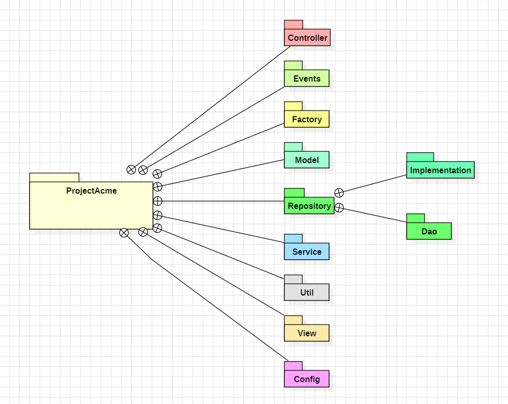

<div align="center">
  <a href="">
    
  </a>
<h1 text-align="center">Acme Business Complex Access Control</h1>
</div>
  
## Table of Contents 🔗
1. [General Information](#general-information-)
2. [Requirements](#requirements-)
3. [System Requirements](#system-requirements-)
4. [Installation and Configuration](#installation-and-configuration-)
5. [Database Model](#database-model-%EF%B8%8F)
6. [Class Structure](#class-structure-)

## General Information 📒

**Acme Business Complex Access Control** is a program developed in Java to record access to a business complex.

For the development of this project, the following technologies were used:

- **MySQL**

- **IntelliJ**

- **Apache NetBeans**

- **StarUML**

## Requirements 📌

Some of the requirements our project addresses are:

### Register and Manage the Entry and Exit of Workers and Guests:

    Record the access of workers and guests to ensure the security of the business complex.

### Register Operations:

    Record who, when, and what for each operation, such as granting access to a guest.

### Generate User Reports:

    Generate reports on system users and those requesting access.

### User-friendly and Efficient Interface:

    A user-friendly design ensures the interface is convenient for users.

## System Requirements 📋

- MySQL version 8.0
- MySQL Workbench Client
or
- DBeaver Client
- JDK 17
- Apache NetBeans

## Installation and Configuration 📦
```bash
git clone https://github.com/JoanSebastianRuiz/ACME.git
```
**Using MySQL Workbench Client or DBeaver Client:**

1. Navigate to the **Database** folder.  
2. Execute the `ddl.sql` file.  
3. Execute the `dml.sql` file.  

**Using Apache NetBeans:**

4. Open the **ProjectACME** folder.  
5. Install the libraries from the **lib** package.  
6. Run the `main` file.  


## Database Model 🗃️


---

## **Entities and Relationships**

### 1. **Scanner**
Represents devices (entry or exit) used to log access events.

| **Property**     | **Type**                 | **Description**                        |
|------------------|--------------------------|----------------------------------------|
| `id`            | INTEGER (PK)            | Unique identifier for the scanner.     |
| `type`          | ENUM (entry, exit)      | Indicates the scanner type.            |

- **Relationships**:  
  Linked to `AccessLog` to record scanner activity.

---

### 2. **AccessLog**
Logs access events recorded.

| **Property**             | **Type**                  | **Description**                          |
|--------------------------|---------------------------|------------------------------------------|
| `id`                    | INTEGER (PK)             | Unique identifier for the log.           |
| `type`                  | ENUM (entry, exit)       | Entry or exit type for the event.        |
| `datetime`              | DATETIME                 | Timestamp of the access event.           |
| `idAccessSubject`       | VARCHAR(10) (FK)         | References the subject being logged.     |
| `idScanner`             | INTEGER (FK, Nullable)   | References the scanner used.             |
| `idAccessSubjectLogger` | VARCHAR(10) (FK, Nullable)| References the user monitoring the event.|

- **Relationships**:  
  - Linked to `Scanner` (via `idScanner`) for tracking scanner activity.  
  - Linked to `AccessSubject` (via `idAccessSubject` and `idAccessSubjectLogger`) to identify the subject being logged and the user monitoring it.

---

### 3. **AccessSubject**
Represents users or individuals accessing the system.

| **Property**       | **Type**                              | **Description**                        |
|--------------------|---------------------------------------|----------------------------------------|
| `id`              | VARCHAR(10) (PK)                    | Unique identifier for the subject.      |
| `name`            | VARCHAR(100)                        | Full name of the subject.               |
| `phone`           | CHAR(10) (Unique)                   | Contact number.                         |
| `emailAddress`    | VARCHAR(100) (Unique)               | Unique email for authentication.        |
| `role`            | ENUM (sudo, manager, officer, securityGuard, worker, guest ) | Role of the subject in the system.      |
| `state`           | ENUM (active, inactive)             | State of the access subject.            |
| `password`        | VARCHAR(100) (Nullable)             | Password for authentication.            |
| `idCompany`       | INTEGER (FK, Nullable)              | References the company the subject belongs to.|

- **Relationships**:  
  - Linked to `Company` to identify the subject’s organization.  
  - Linked to `AccessLog`, `Annotation`, and `Vehicle` for access monitoring and related records.

---

### 4. **Company**
Represents companies inside the business complex.

| **Property**     | **Type**           | **Description**                        |
|------------------|--------------------|----------------------------------------|
| `id`            | INTEGER (PK)       | Unique identifier for the company.     |
| `name`          | VARCHAR(100) (Unique)        | Name of the company.            |
| `phone`         | CHAR(10) (Unique)           | Contact phone number of the company.   |

- **Relationships**:  
  Linked to `AccessSubject` to identify the subject's company.

---

### 5. **Vehicle**
Tracks vehicles associated with subjects.

| **Property**       | **Type**            | **Description**                        |
|--------------------|---------------------|----------------------------------------|
| `plate`           | VARCHAR(6) (PK)     | Vehicle's unique license plate.        |
| `type`            | ENUM (car, motorcycle)| Type of the vehicle.                   |
| `idAccessSubject` | VARCHAR(10) (FK)    | References the vehicle’s owner.        |

- **Relationships**:  
  Linked to `AccessSubject` to track ownership.

---

### 6. **Annotation**
Stores observations or issues related to access subjects.

| **Property**             | **Type**                   | **Description**                          |
|--------------------------|----------------------------|------------------------------------------|
| `id`                    | INTEGER (PK)              | Unique identifier for the annotation.    |
| `datetime`              | DATETIME                  | Timestamp of the annotation.             |
| `reason`                | TEXT(500)                 | Description of the annotation.           |
| `suspended`             | BOOLEAN                   | Indicates if the subject is suspended.   |
| `state`                 | ENUM (active, inactive)    | State of the annotation.                 |
| `idAccessSubject`       | VARCHAR(10) (FK)          | References the subject being annotated.  |
| `idAccessSubjectLogger` | INTEGER (FK)              | References the logger responsible.       |

- **Relationships**:  
  Linked to `AccessSubject` for annotations and monitoring.

---

### 7. **Justification**
Provides explanations for annotations or access-related issues.

| **Property**             | **Type**                  | **Description**                          |
|--------------------------|---------------------------|------------------------------------------|
| `id`                    | INTEGER (PK)             | Unique identifier for the justification. |
| `datetime`              | DATETIME                 | Timestamp of the justification.          |
| `reason`                | TEXT(500)                | Description or explanation provided.     |
| `idAccessSubjectLogger` | VARCHAR(10) (FK)         | References the logger responsible.       |
| `idAnotation`           | INTEGER (FK, Unique)     | References the related annotation.       |

- **Relationships**:  
  - Linked to `Annotation` to justify the withdrawal of the annotation.  
  - Linked to `AccessSubject` as the responsible logger.

## Class Structure ☕

## General Structure For Users


## General Structure Of Packages


## Dao Structure


## Controller And Views


## Events


## Util


## Factory


## Authors 🪶

### Juan José Torres Becerra

## [JuanJTorresB](https://github.com/JuanJTorresB)

### Joan Sebastian Ruiz Angarita

## [JoanSebastianRuiz](https://github.com/JoanSebastianRuiz)

### Joan Sebastian Santos Mosquera

## [RaitonOwO](https://github.com/RaitonOwO)